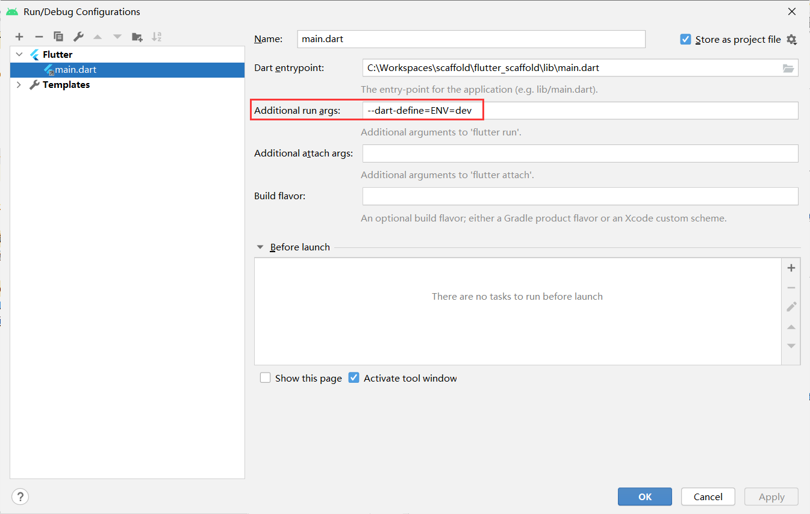

# flutter_scaffold 脚手架说明

A new Flutter project.

## 环境配置
环境配置需要先去 AppConfig 中配置需要的参数，使用指定环境启动时可以用命令指定

    flutter run --dart-define=ENV=dev
或者直接在 Android Studio 里面配置 Additional run args

## 开发说明
### 工程结构

## Trouble Shooting

#### 1.Android 模拟器报 HttpException: Connection closed before full header was received
高版本的Android镜像存在一些问题，亲测 Pixel + Android 8.0(API 26) 没有问题

#### 2.AVD Manager 启动模拟器时报 unable to locate adb
把 Android SDK platform-tools 删了重新下载，platform-tools 位于 sdk directory/platform-tools
如果依然不行，检查项目的 Project SDK 有没有设置，没有设置需要设置上